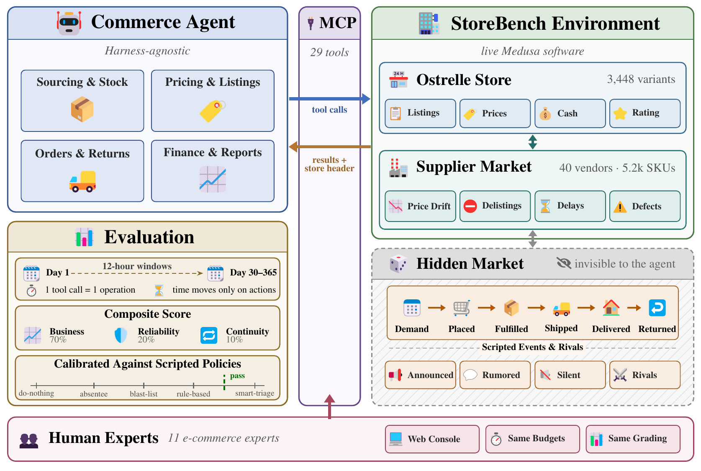

# StoreBench

This bundle accompanies the paper *StoreBench: A Live-Commerce Environment for Evaluating and Training Autonomous Operator Agents*. It contains a
small, self-contained sample that documents the task format, the artifact schema,
and the exact grading procedure, and lets you **reproduce a graded score from an
exported ledger without the simulation environment**.

StoreBench places an agent in charge of a mid-size online apparel store running on
a production-grade commerce backend, and grades sustained economic operation of
the store (net-asset growth, service reliability, and continuity of operation)
against scripted anchor policies.



*Figure 1. StoreBench overview. Agents and human experts operate through the same
merchant tools, operation budgets, and grading. Icons: Microsoft Fluent Emoji (MIT).*

## Held-out evaluation set

**StoreBench is evaluated on a held-out test set that is not publicly released.**
To keep the benchmark a contamination-resistant measure of generalization, the
evaluation tasks, their calibration, and the simulation environment are withheld.
Releasing the evaluation tasks would let models be trained directly on them and
destroy the benchmark's value as a test of operational skill. This repository
therefore provides a representative sample drawn from the **training split**, which
shares the world, tool surface, and scoring with the evaluation tasks but is
disjoint from them.

Researchers who wish to evaluate a model on the held-out set can request access
through the paper's submission system (during review) or the project's public
release (after publication); see *Access* below.

## What is included / withheld

**Included (this bundle):**

- `tasks/`: the definitions (`task.toml`) and rendered prompts for a sample of
training-split tasks.
- `trajectories/`: two example trajectories per training task (graded terminal
ledger + a redacted run summary).
- `scoring/`: the complete scoring definition (`composite.py`) and a standalone
re-grader (`regrade.py`) that reproduces each trajectory's official composite
score from its ledger and the shipped calibration.
- `docs/`: the task and scoring format.

**Withheld:** the simulation engine, the full container image, the complete task
suite, and the entire evaluation set (every evaluation task's prompt,
configuration, and calibration).

## Quickstart

```bash
cd scoring
python3 regrade.py          # recomputes every trajectory's score from its ledger + calibration
```

Expected: `10/10 trajectories reproduced from ledger + calibration.` No
dependencies beyond the Python standard library (Python 3.8+).

## Layout

```
tasks/<task>/task.toml, prompt.txt      training-split task definitions + prompts
trajectories/<task>__s<seed>__<id>/
    score.json                          graded terminal ledger + official reward_composite
    summary.json                        redacted run summary (model, turns, termination, metrics)
trajectories/index.json                 trajectory -> task, seed, reward_composite
scoring/composite.py                    the composite scorer (0.7 business + 0.2 reliability + 0.1 continuity)
scoring/regrade.py                      reproduce scores from ledgers + calibration
scoring/calibration.train.json          per-task-seed calibration for the released training tasks only
docs/task_format.md                     task.toml anatomy and the scoring definition
DATASHEET.md                            dataset documentation
LICENSE                                 MIT
```


## Scoring in one line

`reward_composite = 0.7 · business + 0.2 · reliability + 0.1 · continuity`, where
`business` is net-asset growth normalized against per-task-seed calibration
anchors (clipped to [0, 1]), `reliability` is the mean of the on-time and
return-handled rates, and `continuity` is the fraction of windows the agent acted
in. See `docs/task_format.md` and the paper.

## Interpreting the sample and calibration

Each directory under `trajectories/` contains terminal score components
(`score.json`) and a redacted run summary (`summary.json`). These are summaries
of runs, not per-turn action transcripts or transaction-level ledgers. The
re-grader checks score arithmetic using the supplied net-asset growth, service
rates, continuity, and calibration. It does not replay the simulation or
independently reconstruct settlement, service rates, or window attendance.

The business zero is the higher raw business result of the do-nothing and
absentee anchors. The scale is the gap from that zero to the higher raw business
result of the rule-based and smart-triage anchors, divided by 0.70 and rounded to
two decimal places. This maps the better judgment anchor to approximately 0.70,
leaving room for stronger policies. The division by 0.70 defines the normalization;
it is separate from the business component's 0.7 weight in the composite.
This clarifies the implementation used for the supplied calibration; no
calibration values, anchor scores, pass thresholds, or sample scores were changed.

## Access to the held-out evaluation

During peer review, requests can be made through the submission system. After
publication, the public release will describe how to evaluate a model against the
held-out set. The simulation environment and full task suite are not distributed.

## Citation

```bibtex
@inproceedings{storebench2027,
  title     = {StoreBench: A Live-Commerce Environment for Evaluating and Training Autonomous Operator Agents},
  author    = {Anonymous Authors},
  booktitle = {Under review},
  year      = {2027}
}
```


## License

MIT (see `LICENSE`). The sample tasks and trajectories are released for research
use under the same terms.